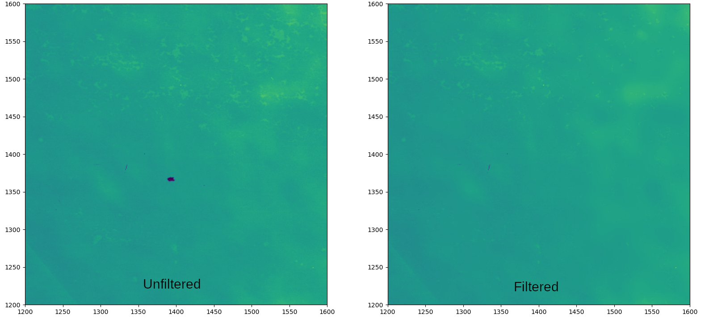

# Dust Correction Package for SUIT
- Created to remove dust spots from SUIT images.
- Not to be confused with PRNU.
- To be used in L2 data products.
- Uses LED/ PRNU images to indentify dust spots in the images and corrects them with morphological filter.
- Morphological method is also available for filtering based on thresholds, if PRNU does not pick up a dust spot.

Created by Janmejoy Sarkar @ [SUIT](https://suit.iucaa.in)LAB\
Initiated in Jun 2024.

## Screenshots

## Authors

- [@janmejoysarkar](https://github.com/janmejoysarkar)

## Acknowledgements

 - [IUCAA, Pune](https://www.iucaa.in)
 - [ISRO, Aditya-L1](https://www.isro.gov.in/Aditya_L1.html)

